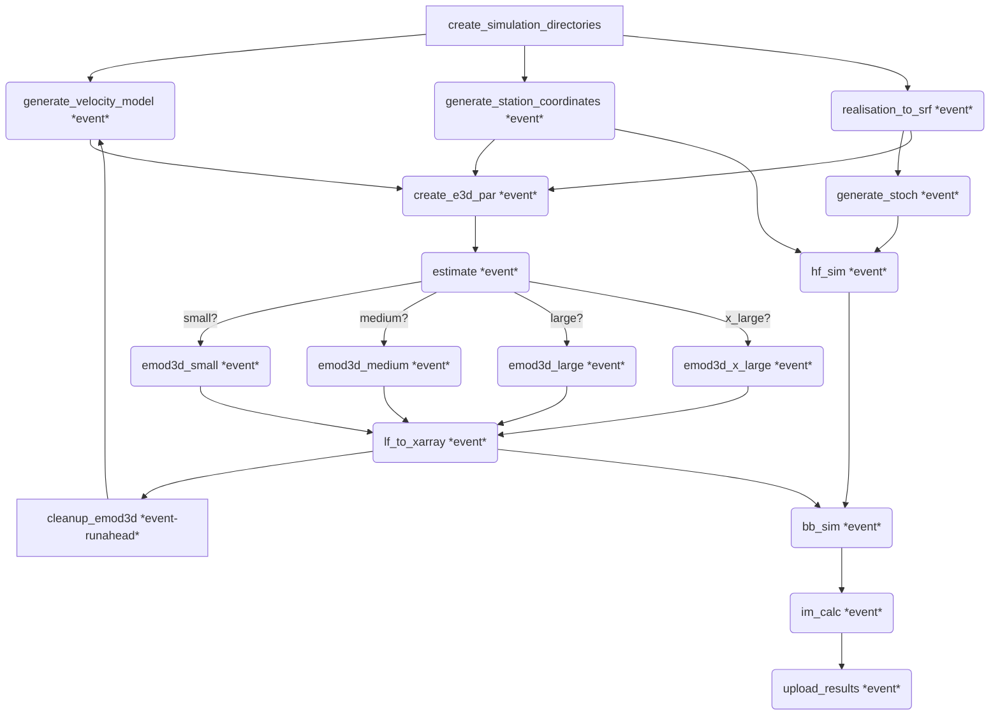

# Simulation workflow template

This repo is a simulation workflow template. Use this as a starting point for
your own simulations by setting this repository as the template repository
in the new repository flow on GitHub.

## Simulation folder structure

```
flow
├── bin
│   └── estimate_job_size
├── events.json
├── flow.cylc
├── lib
│   └── python
│       └── load_data.py
└── stations
    ├── stations.vs30
    └── stations_input.ll
```

The flow folder contains the actual workflow. The files contained in the directory are, roughly:

1. `estimate_job_size`, an awk script that estimates job size. Prints "small", "medium", "large" or "x-large" depending the simulation volume. Accepts an e3d.par file.
2. `events.json`, a json array of events to run.
3. `flow.cylc`, the workflow definition file.
4. `lib/python/load_data.py`, tiny helper function to load json data.
5. `stations/stations.vs30` and `stations.ll`, global station file. Used to generate station outputs for individual simulations.

## Simulation workflow graph



| Stage                         | Event Parameter    | Description                                                                                                                                                |
| ----------------------------- | ------------------ | ---------------------------------------------------------------------------------------------------------------------------------------------------------- |
| bb_sim                        | event              | Performs broadband simulation.                                                                                                                             |
| cleanup_emod3d                | event-{{runahead}} | Cleans up EMOD3D run files after successful EMOD3D run. The `event-{{runahead}}` parameter implies that **at most {{runhead}} events** can be run at once. |
| create_e3d_par                | event              | Creates EMOD3D parameters file.                                                                                                                            |
| create_simulation_directories | event              | Unpacks realisation tarball into `$CYLC_WORKFLOW_DIRECTORY`.                                                                                               |
| emod3d_large                  | event              | EMOD3D large job pathway.                                                                                                                                  |
| emod3d_medium                 | event              | EMOD3D medium job pathway.                                                                                                                                 |
| emod3d_small                  | event              | EMOD3D small job pathway.                                                                                                                                  |
| emod3d_x_large                | event              | EMOD3D x-large job pathway.                                                                                                                                |
| estimate                      | event              | Estimates job size for EMOD3D based on simulation volume.                                                                                                  |
| generate_station_coordinates  | event              | Generates station coordinates from global station file.                                                                                                    |
| generate_stoch                | event              | Generates stochastic input file for high-frequency simulation.                                                                                             |
| generate_velocity_model       | event              | Generates a velocity model.                                                                                                                                |
| hf_sim                        | event              | Performs high-frequency simulation.                                                                                                                        |
| im_calc                       | event              | Performs intensity measure calculations.                                                                                                                   |
| lf_to_xarray                  | event              | Converts EMOD3D outputs into xyts + waveform files.                                                                                                        |
| realisation_to_srf            | event              | Produces SRF.                                                                                                                                              |
| upload_results                | event              | Uploads results.                                                                                                                                           |

### Workflow queues

To avoid overwhelming HPCs the workflow has internal queues that buffer the number of simultaneous jobs submitted in each category.

| Queue      | Jobs                                                                                            | Limit |
| ---------- | ----------------------------------------------------------------------------------------------- | ----: |
| rclone     | upload_results                                                                                  |     1 |
| large_job  | emod3d_large                                                                                    |     4 |
| medium_job | emod3d_medium                                                                                   |     4 |
| small_job  | emod3d_small                                                                                    |     4 |
| throttle   | create_e3d_par, bb_sim, im_calc, realisation_to_srf, generate_station_coordinates, lf_to_xarray |     3 |
| hf         | generate_stoch, hf_sim                                                                          |     5 |
| vm         | generate_velocity_model                                                                         |     5 |
