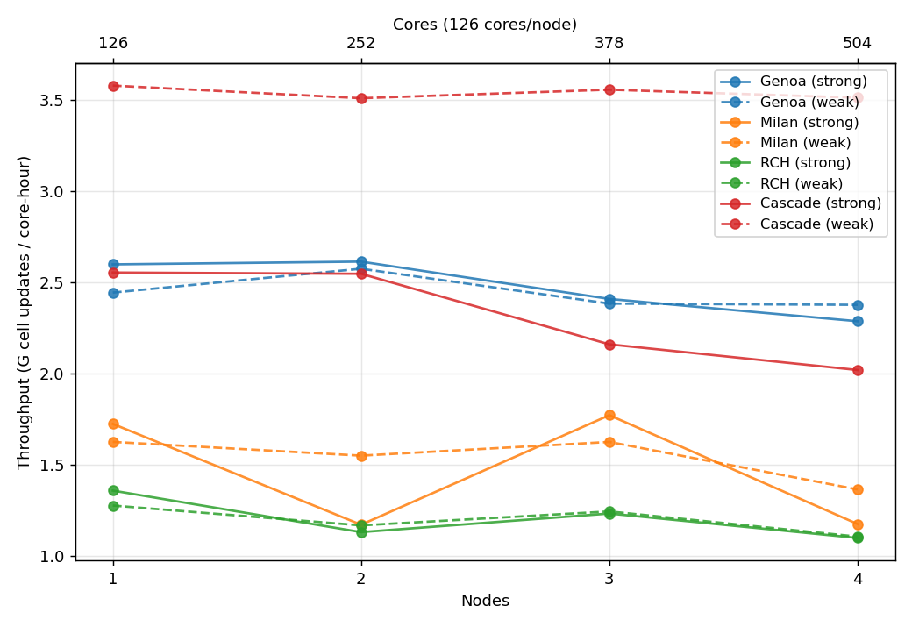

# SW4 scale test

A scaling-performance benchmark for the [SW4](https://github.com/geodynamics/sw4)
earthquake-simulation code, run on several HPCs.
The headline output is **per-core throughput in
Giga (G) cell-updates per core-hour** for each HPC — enough to estimate
wall-time and core-hours for a planned SW4 run before submitting it.

See the [Estimating](Estimating.md) page for the formula, per-HPC
numbers, worked examples, and caveats.

> **Draft status.** A binary-rebuild campaign on NeSI and RCH was
> completed but the post-rebuild scaling-test data hasn't been
> collected yet. Numbers below are **current measurements**
> (pre-rebuild for NeSI/RCH, current AVX-512 build for cascade);
> projected post-rebuild numbers are flagged as such. This wiki will
> be finalised when the queued campaign completes.

## HPCs measured

Per-core throughput numbers below assume a roughly cubic per-rank
brick — typical for production earthquake simulations. Slab-shaped
grids run somewhat slower; see the
[Estimating](Estimating.md) page for the adjustment.

| HPC           | Owner  | Architecture           | Cores/node | Per-core throughput (G cell-updates / core-hour) |
|---            |---     |---                     |---         |---                                               |
| Cascade       | ESNZ   | Zen4 Genoa, DDR5-4800  | 384        | **3.5**                                          |
| Mahuika genoa | REANNZ | Zen4 Genoa, DDR5-4800  | 336        | 2.5 (rebuild → expected ~3.5)                    |
| Mahuika milan | REANNZ | Zen3, DDR4-3200        | 128        | 1.5 (rebuild → expected ~2.0)                    |
| RCH           | UC     | Zen3, DDR4             | 144–192    | 1.2 (rebuild → expected ~1.5)                    |

## Scaling behaviour

Per-core throughput vs. node count, all four HPCs, no NaN checking.
The two curves per HPC reflect different per-rank brick shapes used
in the scaling-test campaigns; for production planning the upper
(weak) curve is the relevant one — that's the shape most real
simulations have. All measurements at 126 ranks/node (lowest common
denominator across the HPCs, picked for comparability — not the
production-optimum on any individual cluster).

## Headline guidance

For most SW4 production workloads (large grids, many time steps):

- **Best per-core throughput**: Cascade (today), genoa-after-rebuild
  (soon). Both are Zen4 with DDR5. Cascade has the longer track
  record at full AVX-512.
- **If cascade isn't available**: genoa is the next-best Zen4 option;
  milan and RCH are Zen3 and run at roughly half the per-core
  throughput.
- **Predictable wall-clock budgets**: cascade has the steadiest weak
  scaling (~98 % out to 4 nodes). RCH is the steadiest DDR4 option.
- **Avoid milan if alternatives exist** — not because it's slow on
  average (similar to RCH at the mean) but because per-job variance is
  large enough that an individual run's wall-time is hard to predict
  to better than ±50 %.

For the full per-HPC breakdown, throughput formula, and worked
examples, see [Estimating](Estimating.md).
